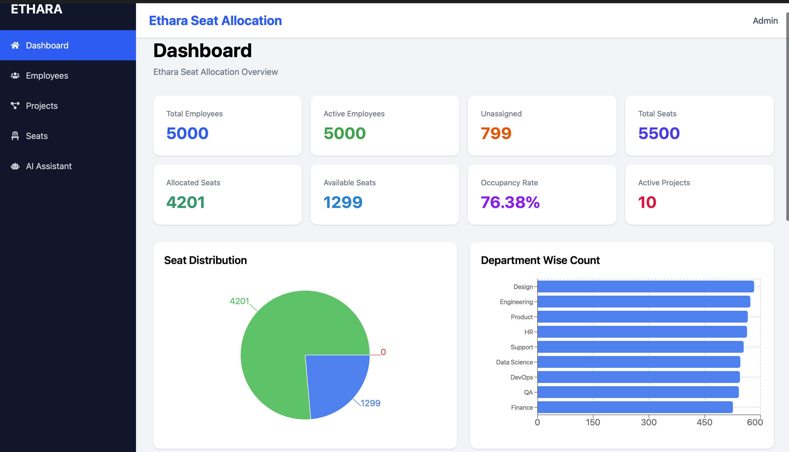
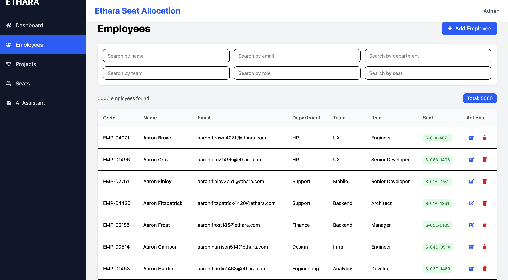
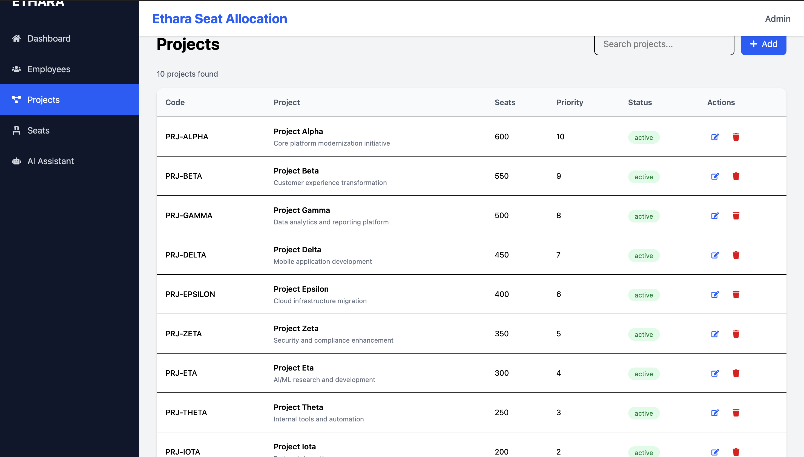
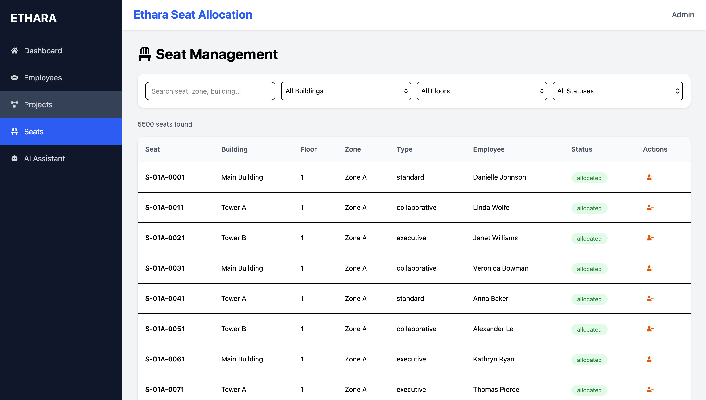

# 🚀 Ethara Seat Allocation System

A production-ready Full Stack Seat Allocation & Project Mapping System built using **React, FastAPI, SQLite, Tailwind CSS**, and deployed on **Vercel** and **Render**.

---

## ✨ Features

- 📊 Dashboard Analytics
- 👨‍💼 Employee Management
- 📁 Project Management
- 💺 Seat Allocation
- 🔍 Search & Filter
- 🤖 AI Assistant
- 📈 Occupancy Statistics
- ⚡ REST APIs
- 🌐 Fully Deployed Application

---

# 🛠 Tech Stack

### Frontend
- React.js
- Vite
- Tailwind CSS
- Axios
- React Router
- Recharts

### Backend
- FastAPI
- SQLAlchemy
- Pydantic

### Database
- SQLite

### Deployment
- Vercel
- Render


# 📷 Screenshots

## Dashboard



## Employees



## Projects



## Seats



## AI Assistant


---
---

# 🚀 Live Demo

### 🌐 Frontend

https://ethara-seat-allocation-system-five.vercel.app

### ⚙️ Backend API

https://ethara-seat-allocation-system-t0he.onrender.com

### 📚 API Documentation (Swagger UI)

https://ethara-seat-allocation-system-t0he.onrender.com/docs

---

# 📂 Project Structure

```text
Ethara_Seat_Allocation/
│
├── backend/
│   ├── app/
│   ├── requirements.txt
│   ├── ethara.db
│   └── main.py
│
├── frontend/
│   ├── src/
│   ├── public/
│   ├── package.json
│   └── vite.config.js
│
├── screenshots/
├── README.md
└── AI_PROMPTS.md
```

---

# ⚙ Installation

## Clone Repository

```bash
git clone https://github.com/BarjatyaAjay/ethara-seat-allocation-system.git
```

```bash
cd ethara-seat-allocation-system
```

## Backend

```bash
cd backend

python -m venv .venv

source .venv/bin/activate

pip install -r requirements.txt

uvicorn app.main:app --reload
```

Backend

```
http://127.0.0.1:8000
```

## Frontend

```bash
cd frontend

npm install

npm run dev
```

Frontend

```
http://localhost:5173
```

---

# 📡 API Endpoints

## Employees

- GET /api/v1/employees
- POST /api/v1/employees
- PUT /api/v1/employees/{id}
- DELETE /api/v1/employees/{id}

## Projects

- GET /api/v1/projects
- POST /api/v1/projects
- PUT /api/v1/projects/{id}
- DELETE /api/v1/projects/{id}

## Seats

- GET /api/v1/seats
- POST /api/v1/seats/allocate
- POST /api/v1/seats/release

## Dashboard

- GET /api/v1/dashboard/summary

## AI Assistant

- POST /api/v1/ai/query

---

# 🔮 Future Improvements

- JWT Authentication
- Role-Based Access Control
- PostgreSQL
- Docker
- Kubernetes
- CI/CD
- Floor Map Visualization
- Email Notifications
- Dark Mode

---

# 👨‍💻 Author

**Ajay Bairwa**

- GitHub: https://github.com/BarjatyaAjay
- LinkedIn: *(Add your LinkedIn URL here)*

---

⭐ If you found this project useful, consider giving it a star.